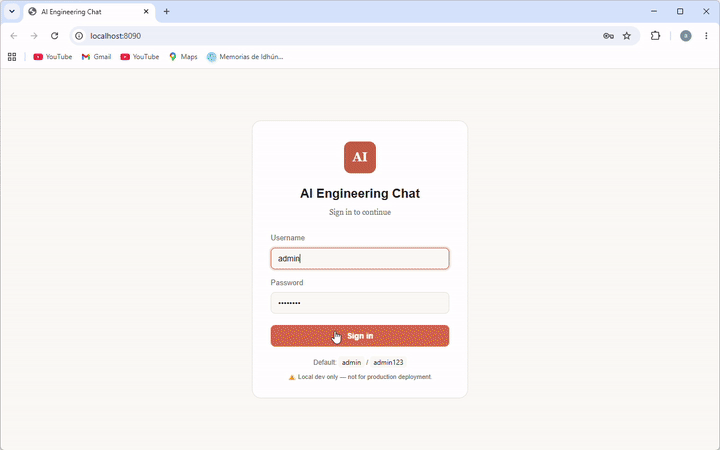

# AI Engineering Portfolio

> Self-hosted LLM agent on a laptop GPU — inference, RAG, fine-tuning, tool calling. All local, no cloud APIs, MIT-licensed.

A complete **AI agent** system that runs on a **4GB VRAM laptop GPU** (RTX 3050).

- **Inference**: Ollama + `qwen2.5:3b` (Q4_K_M, 1.9GB) — 68 tok/s
- **RAG**: Qdrant + sentence-transformers — **+83% answer relevance** vs no-RAG
- **Fine-tuning**: Unsloth LoRA on 230 examples — merged to GGUF Q4_K_M
- **Tool calling**: 6 real tools, 80-line agent loop, no LangChain
- **Multi-tool chaining**: 5/5 — agent plans and executes 2-3 tools in parallel
- **Streaming**: real tokens from Ollama (no fake delays, TTFT ~2s)
- **Web UI**: Claude-like SPA with dark/light theme, multi-conversation, compare mode
- **Authentication**: JWT user-based login (scrypt-hashed passwords, HMAC-SHA256 tokens)
- **Security**: rate limiting, CORS, XSS escape, scanner block, 401-redirect
- **93 pytest tests** with a regression runner that catches metric drift
- **One-command setup**: `docker compose up` starts the entire stack

## Live demo



*2 min walkthrough: login → GPU tool call → RAG over docs → compare base vs fine-tuned. Full video at [docs/demo.webm](docs/demo.webm) (9 MB).*

Open <http://localhost:8090> and log in with `admin` / `admin123`.

After `setup.bat` (Windows) or `./setup.sh` (Linux/Mac), open <http://localhost:8090> and log in with `admin` / `admin123`.

| URL | What |
|---|---|
| http://localhost:8090 | Chat with the agent (login required) |
| http://localhost:8090/architecture | Interactive system diagram |
| Ctrl+M in chat | Compare base vs fine-tuned side-by-side |
| http://localhost:11434 | Ollama API |
| http://localhost:6333 | Qdrant API |
| http://localhost:8000 | RAG API |

## Quick start

### Windows
```
setup.bat                 # check + start everything
setup.bat bootstrap       # also populate Qdrant with knowledge base
```

### Linux / Mac
```
./setup.sh                # check + start everything
./setup.sh bootstrap      # also populate Qdrant with knowledge base
```

After setup, open http://localhost:8090 and log in with the default credentials
(`admin` / `admin123`). **Change the password in production** (see
[app/docs/AUTH.md](app/docs/AUTH.md) for user management).

## Architecture

```
                   Browser
                      |
                      v
        +----------------------------+
        |  Chat App (FastAPI :8090)  |
        |  - Login screen (JWT)      |
        |  - SPA (vanilla JS)        |
        |  - SSE streaming           |
        |  - Tool cards              |
        |  - Auth: Bearer <JWT>      |
        +-----------+----------------+
                    |
        +-----------v----------------+
        |  Agent Loop (80 lines)     |
        |  run_agent_streaming()     |
        |  - Early-stop on loop      |
        |  - MAX_ITER = 3            |
        +---+------+--------+--------+
            |      |        |
   +--------+  +---v----+  +v-------+
   |        |  | 6 Tools|  | Ollama |
   |        |  | - RAG  |  | :11434 |
   |        |  | - GPU  |  | qwen2.5|
   |        |  | - Qdr  |  |   :3b  |
   |        |  | - PDF  |  |  -FT   |
   |        |  +--------+  +--------+
   |        |
+--v---+ +---v----+
| RAG  | | Qdrant |
| API  | |  :6333 |
| :8000| +--------+
+------+
```

Full interactive diagram: http://localhost:8090/architecture

## Project structure

```
ai-engineer-portfolio/
|-- README.md                       <- you are here
|-- LICENSE                         <- MIT
|-- docker-compose.yml              <- one-command full stack
|-- setup.bat / setup.sh            <- cross-platform setup
|-- .gitignore
|
|-- app/                            <- THE PROJECT. The main code lives here.
|   |-- README.md                   <- detailed docs for the app
|   |-- Dockerfile
|   |-- docker-compose.yml
|   |-- requirements.txt
|   |-- pytest.ini
|   |-- docs/                       <- app-specific docs (AUTH, SECURITY, etc.)
|   |-- scripts/                    <- backend (chat_app.py, agent loop, tools, auth, evals)
|   |-- tests/                      <- 93 pytest tests (89 unit + 4 E2E)
|   |-- data/                       <- eval results, users.json, generated PDFs (PDFs gitignored)
|   `-- slides/                     <- PPTX generation (PptxGenJS)
|
|-- infrastructure/                 <- Ollama docker-compose (used by root docker-compose.yml)
|   `-- docker-compose.yml
|
`-- docs/                           <- top-level documentation
    |-- architecture.md
    |-- screenshots/                <- (empty for now)
    `-- development-notes/          <- process notes (setup, fine-tuning, agent design)
        |-- 00-setup.md
        |-- 03-finetuning.md
        `-- 04-agent-design.md
```

**Where to start**:
- **If you want to USE the app**: `app/README.md` has quick start, tools list, evals
- **If you want to UNDERSTAND the system**: `app/scripts/` (80-line agent loop) + `app/scripts/chat_app.py` (FastAPI backend)
- **If you want to know HOW it was built**: `docs/development-notes/`
- **For AUTH setup / adding users**: `app/docs/AUTH.md`

## Tests

```bash
cd app
python -m pytest tests/ -v                # 93 tests (89 unit + 4 E2E, E2E skipped if no server)
python scripts/regression_test.py         # catches metric drift
```

Latest run: **93/93 passing**.

## Highlights (what this project demonstrates)

1. **Engineering under real constraints** (4GB VRAM, no cloud)
2. **Defensible decisions** with data, not vibes (every choice has a tested "why")
3. **Honest reporting**: LoRA fine-tuning on 230 examples did not add new capability
   (base model already knew tool calling) — documented, not hidden
4. **Performance-aware streaming**: TTFT ~2s, early-stop prevents infinite loops
   (RAG queries that used to take 60s now finish in 20s)
5. **Thread-safety by design** (contextvars, not monkey-patching)
6. **Production-ready auth**: JWT + scrypt + rate-limited login + 401-redirect
7. **Security from day 1**: rate limit, CORS, XSS escape, scanner block, DoS protection
8. **93 tests** with regression runner that catches metric drift

## License

MIT — see [LICENSE](LICENSE).
